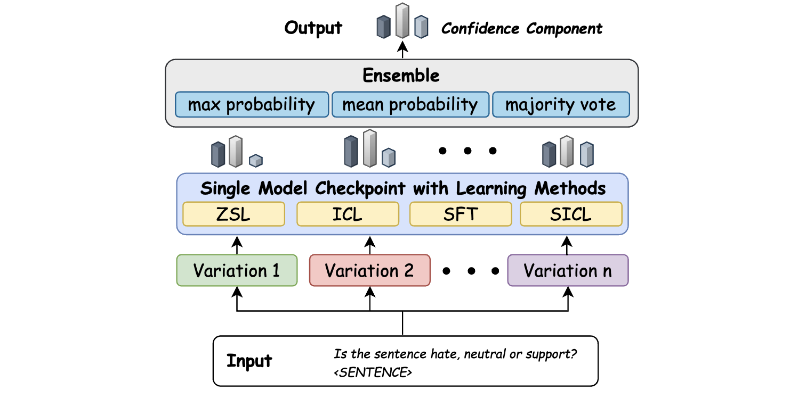

# Code for On Task Performance and Model Calibration with Supervised and Self-Ensembled In-Context Learning 


Link to paper: [On Task Performance and Model Calibration with Supervised and Self-Ensembled In-Context Learning](https://arxiv.org/abs/2312.13772)

Please cite the paper when using the code. 

```
@misc{li2023task,
      title={On Task Performance and Model Calibration with Supervised and Self-Ensembled In-Context Learning}, 
      author={Chengzu Li and Han Zhou and Goran Glavaš and Anna Korhonen and Ivan Vulić},
      year={2023},
      eprint={2312.13772},
      archivePrefix={arXiv},
      primaryClass={cs.CL}
}
```

## Overview
- Configuration file for different learning paradigm `cfg`
- Data split for low-resource scenarios of NLU++ in `cvs_data/nlupp-splits`
- Ensembling configuration files for different tasks in `esb_cfg`
- All prompt templates in `prompt`
- Customized trainer, evaluator, data loading scripts, in-context example retriever and etc. in `utils`
- Example scripts in `scripts`

## Environment Setup
```
pip install -r requirements.txt
```
You also have to setup your wandb account by specifying `WANDB_API_KEY` and `WANDB_ENTITY` in the `train_ft.py`.  

## Configuration Files and Prompt Templates

`./cfg` configuration file for different learning paradigm
    
    define the hyperparameters, evaluation strategy, icl setups
    
    for ICL setups, you can specify the settings below. 
        icl_cfg:
          ic_num: 10                the number of in-context examples
          order: 'random'           the order of in-context examples
          ic_pool: 'train'          from which source to retrieve the ic examples
          retrieve: 'random'        how to retrieve the ic examples
          retrieve_key: 'input'     the keys being used to retrieve ic examples


`./prompt`      define the template and example template

    * template: has to contain the symbol '<EXAMPLE_PAIRS>' and '<INPUT>'
    * example_template: defines the template for each example. it has to contain the symbol '<INPUT>' and '<LABEL>'


For the format of each example, you can control it by specifying the input argument in the training scripts.

## Scripts
Here we only present the basic usage of the command. 
You can find more detailed instruction in `scripts` folder along with more examples. 
### Single time training and inference scripts
#### SupICL
```commandline
python train_ft.py \
--do_train \
--do_predict \
--mode supicl \
--model google/flan-t5 \
--model_version large \
--data sst5 \
--task sst5 \
--input_format sst5 \
--seed ${SEED} \
--train_size 50 \
--with_logprob
```
For other learning methods, we refer the reader to scripts to find out the usage. 

### Ensembling scripts
The ensembling scripts can call the scripts of model training and inference multiple times automatically.
Therefore, if you would like to test the ensembling performance with different learning methods, you can follow the scripts below. 
#### SupICL
```commandline
python ensemble_postprocess.py \
--mode supicl \
--model_version large \
--data sst5 \
--task sst5 \
--input_format sst5 \
--train_size 50 \
--train_seeds 0 21 42 \
--use_logprobs \
--keep_distinct \
--strategy mean_prob \
--esb_num 20 \
--do_tune \
--do_inference \
--output OUTPUT_PATH
```

## Debug
if you would like to debug on a small set of data, you could just add `--toy` at the end of the scripts.